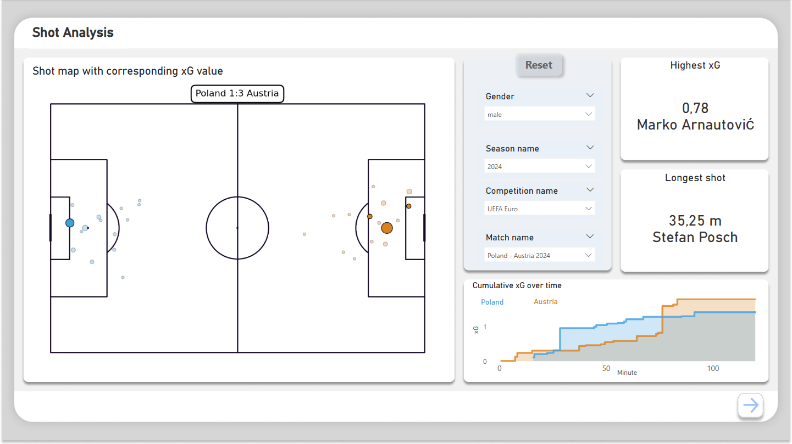
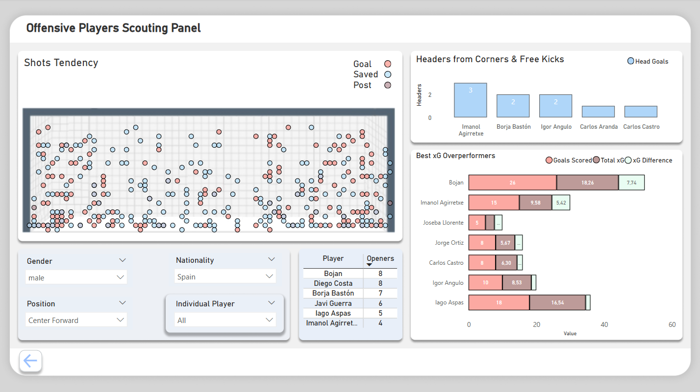

# 🗺️ Power BI Dashboards

This repository contains two interactive football dashboards included in the `football_dashboard.pbix` file. You can explore them and experiment with filters and views under the following link:

- 🔗 [Interactive dashboards](http)

The dataset powering these dashboards (`powerbi.csv`) is available directly in this repository. Alternatively, you can generate it by setting the `powerbi` flag to `True` at the beginning of the `data_preparation.ipynb` script.  
The dataset contains all available matches that can be extracted using the `statsbombpy` Python library.

---

 
     
  <em>Match Analysis Dashboard.</em> 

The main element of this dashboard is a **shot map** visualizing shooting locations and corresponding xG (Expected Goals) values — the larger the circle, the higher the xG value. If the circle is filled, it indicates that the shot resulted in a goal. The home team's shots are displayed on the left, and the away team's on the right.  
To the right of the shot map, you can find interactive filters to select the match of interest. Next to that, two key indicators display the **highest xG value for a single chance** and the **longest shot distance** in the selected match. At the bottom, an xG timeline shows how cumulative xG evolved throughout the game.

---

 
     
  <em>Scouting Support Dashboard.</em> 

This dashboard focuses on scouting insights. The goal map visualizes the shot locations and outcomes for selected players, making it easy to assess finishing tendencies. Below the map, filters allow you to select one or multiple players.  
The accompanying table highlights the most prolific **first goal scorers** — players with the highest number of opening goals in matches.  
On the right, you'll find two charts:
- **Top headers scorers from set-pieces** (corners and free kicks),
- **Best overperformers**, i.e., players with the largest positive difference between actual goals scored and their xG.

---

The visual structure and design of the dashboards were created using `Figma`. The project files, along with additional images, are located in the `Images` folder.  
The football goal illustration used in the scouting dashboard originates from **Wyscout**.

---

### ✅ Tools & Technologies
- Power BI
- Python (`statsbombpy` library)
- Figma (dashboard design)
- StatsBomb Open Data
- Wyscout (visual elements)

## 📂 Repository Structure

`powerbi_dashboards/`  
`├── README.md`  
`├── data_preparation.ipynb`  
`├── powerbi_dataset.csv` 
`├── football_dashboard.pbix`   
`├── images/`  
`│     ├── canva_shot_map.png`  
`│     ├── shot_map.png`  
`│     ├── canva_scouting_panel.png`  
`│     ├── scouting_panel.png`  
`│     └── goal.png`