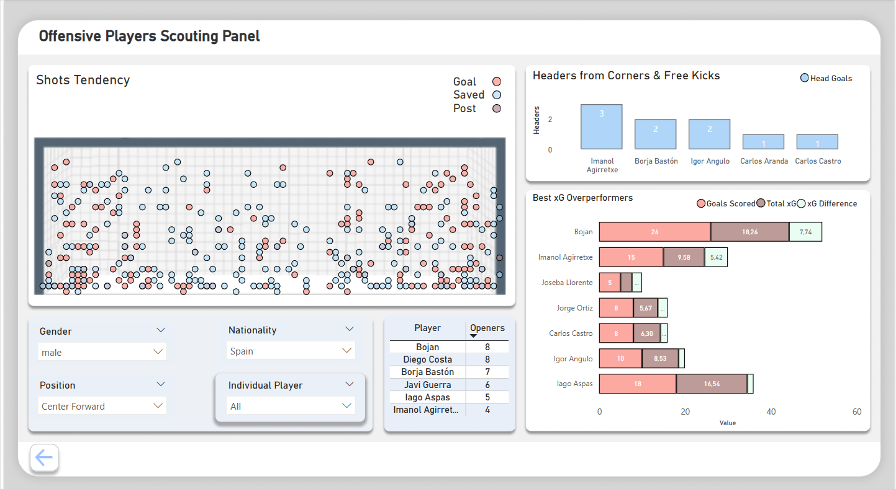

🗺️ Power BI Dashboards
The same dataset was also used to create two interactive dashboards: Shot Analysis and Offensive Players Scouting Panel.

The dataset for these dashboards (`powerbi.csv`) is available in this repository. Alternatively, you can generate it by setting the `powerbi` flag to `True` at the beginning of the `data_preparation.py` script.

    <em>Shot map with corresponding xG values, alongside key match information such as cumulative xG.</em> 

    <em>Shot map tendency visualisation, where the goal frame graphic is based on Wyscout materials. The dashboard also includes key match insights such as best xG overperformers.</em> 

Both dashboards are included in the `football_dashboard.pbix` file. You can explore them interactively and experiment with filters and views under the following link:

- 🔗 [Interactive dashboards](http)

The visual layout and structure of the dashboards were designed using `Figma`, with the project files included in the `Images` folder.

---
